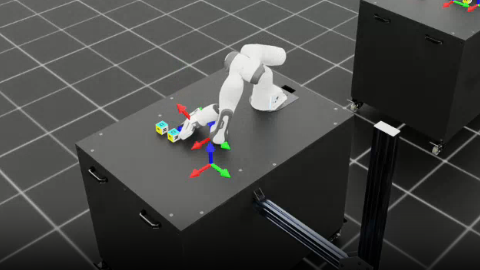

---

# Isaac Lab Push

[](https://docs.omniverse.nvidia.com/isaacsim/latest/overview.html)
[](https://docs.python.org/3/whatsnew/3.10.html)
[](https://releases.ubuntu.com/20.04/)
[](https://www.microsoft.com/en-us/)
[](https://pre-commit.com/)
[](https://isaac-sim.github.io/IsaacLab)
[](https://opensource.org/licenses/BSD-3-Clause)

## Introduction

This repository is part of a research project supervised by [Professor Glen Berseth](https://neo-x.github.io/). It involves using IsaacLab and the Proximal Policy Optimization (PPO) algorithm to solve multi-block push tasks. The project also implements a hierarchical control framework to enhance task performance and scalability.

[**Isaac Lab**](https://github.com/isaac-sim/IsaacLab) was used as the simulation platform for our project to implement and evaluate hierarchical control and reinforcement learning algorithms for multi-block manipulation tasks.

Isaac Lab is a unified and modular framework for robot learning that aims to simplify common workflows
in robotics research (such as RL, learning from demonstrations, and motion planning). It is built upon
[NVIDIA Isaac Sim](https://docs.omniverse.nvidia.com/isaacsim/latest/overview.html) to leverage the latest
simulation capabilities for photo-realistic scenes and fast and accurate simulation.

Please refer to [documentation page](https://isaac-sim.github.io/IsaacLab) to learn more about the
installation steps, features, tutorials, and how to set up customized project with Isaac Lab.

## Task Extensions and Hierarchical Control

In the directory [`manager_based/manipulation`](https://github.com/Yannyehao/Isaac-Lab-Push/tree/main/source/extensions/omni.isaac.lab_tasks/omni/isaac/lab_tasks/manager_based/manipulation), we added and tested several new tasks: `push`, `push2_1`, `push2_2`, and `push3_3`.

- The [`push`](https://github.com/Yannyehao/Isaac-Lab-Push/tree/main/source/extensions/omni.isaac.lab_tasks/omni/isaac/lab_tasks/manager_based/manipulation/push) task is a new task type not available in the original repository. It was implemented by designing a custom reward function.  
- The [`push2_1`](https://github.com/Yannyehao/Isaac-Lab-Push/tree/main/source/extensions/omni.isaac.lab_tasks/omni/isaac/lab_tasks/manager_based/manipulation/push2_1) task involves pushing two blocks to one target.  
- The [`push2_2`](https://github.com/Yannyehao/Isaac-Lab-Push/tree/main/source/extensions/omni.isaac.lab_tasks/omni/isaac/lab_tasks/manager_based/manipulation/push2_2) task involves pushing two blocks to two targets.  
- The [`push3_3`](https://github.com/Yannyehao/Isaac-Lab-Push/tree/main/source/extensions/omni.isaac.lab_tasks/omni/isaac/lab_tasks/manager_based/manipulation/push3_3) task involves pushing three blocks to three targets.  

During experimentation, we found that using a single reward function to handle multi-target tasks often fails to achieve satisfactory results, even if theoretically possible. Hierarchical control proved to be an effective solution for these complex tasks.


### Results and Demonstrations

In this section, we present demonstrations of the trained models in action:

- [Push1-1 Demo Video](https://drive.google.com/file/d/1moajrE3K5YBhADNsS6NsvglQM0956MUr/view?usp=drive_link)
- [Push2-2 Demo Video](https://drive.google.com/file/d/1Qe17VZAEfXbi7h0lbjlE2ZKxm4TLRY3Y/view?usp=drive_link)
- [Push3-3 Demo Video](https://drive.google.com/file/d/1To_WHdxHNC5GRiN6GSEWNWjuZHS-lyX9/view?usp=drive_link)


## Reflections and Insights

First and foremost, I would like to express my heartfelt gratitude to Glen, Albert, Kirsty, and Alexis for their support and guidance throughout this journey. None of this would have been possible without their encouragement and the opportunities they provided.

Training a robotic arm using deep reinforcement learning in a simulation platform is a challenging task. Even though Isaac Lab has streamlined and integrated many aspects of this process, the learning curve for new users remains steep. The first few months of this project were entirely dedicated to learning how to use Isaac Lab—configuring the environment, reading the official documentation, and diving into the source code. These experiences were invaluable in sharpening my technical skills and problem-solving abilities.

Once I had a good grasp of Isaac Lab's primary functions and framework, I faced new challenges: modifying the base environment to fit my requirements, adjusting environment settings, managing model training and storage, understanding the rationale behind reward functions, organizing and managing experiments, communicating results effectively with professors and collaborators, and troubleshooting mysterious bugs. These are skills that cannot be fully learned through lectures or advice—they can only be developed through hands-on experience and persistence.

One piece of advice from Glen that resonated deeply with me is:
*"Research life is nonlinear, but as a student, your learning should be linear."*
This perfectly captures the essence of this journey. There are always problems to solve and things I do not know, and I cannot expect to know or master everything at once. The best I can do is to continuously learn from others, move forward through challenges, and adapt to new situations.

But how do we progress through problems? My robotic arm "friend" has taught me an important lesson: trying to do too many things at once often leads to accomplishing none. Setting clear priorities, focusing on one task at a time, and progressing step by step is the only way to truly make progress. Paradoxically, moving slowly and deliberately often allows us to move faster in the long run.

Finally, I want to thank Glen once again for giving me this incredible opportunity. This project has been a transformative experience, and I am deeply grateful for his trust and mentorship.

## License

The Isaac Lab framework is released under [BSD-3 License](LICENSE). The license files of its dependencies and assets are present in the [`docs/licenses`](docs/licenses) directory.

## Acknowledgement

Isaac Lab development initiated from the [Orbit](https://isaac-orbit.github.io/) framework. 

```
@article{mittal2023orbit,
   author={Mittal, Mayank and Yu, Calvin and Yu, Qinxi and Liu, Jingzhou and Rudin, Nikita and Hoeller, David and Yuan, Jia Lin and Singh, Ritvik and Guo, Yunrong and Mazhar, Hammad and Mandlekar, Ajay and Babich, Buck and State, Gavriel and Hutter, Marco and Garg, Animesh},
   journal={IEEE Robotics and Automation Letters},
   title={Orbit: A Unified Simulation Framework for Interactive Robot Learning Environments},
   year={2023},
   volume={8},
   number={6},
   pages={3740-3747},
   doi={10.1109/LRA.2023.3270034}
}
```
